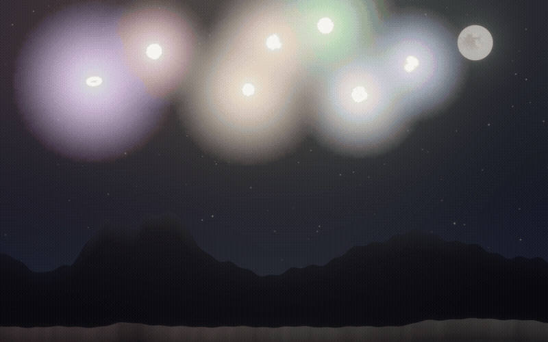
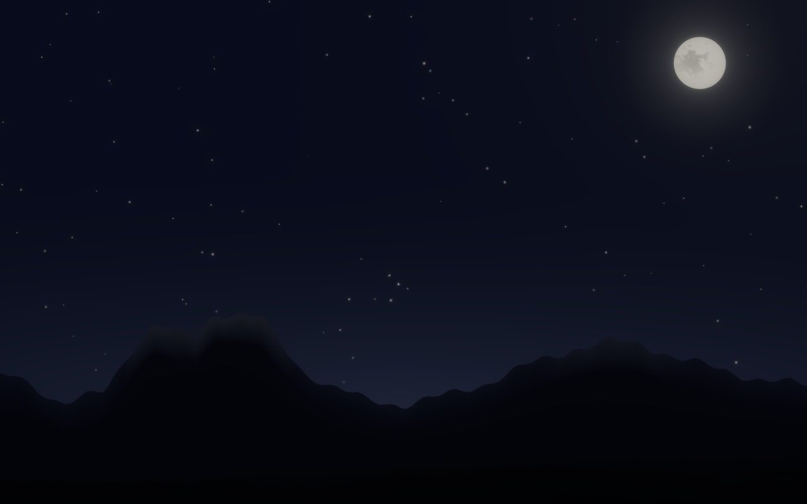
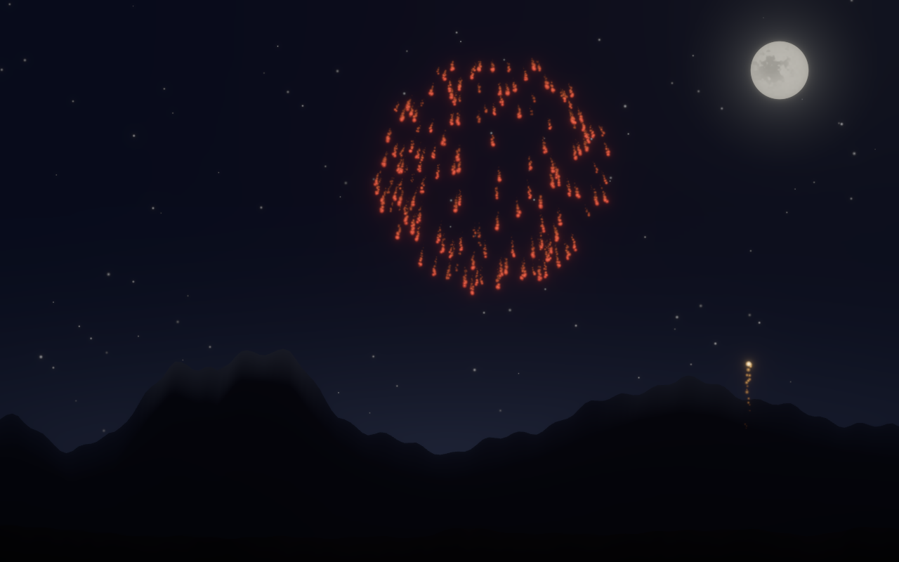
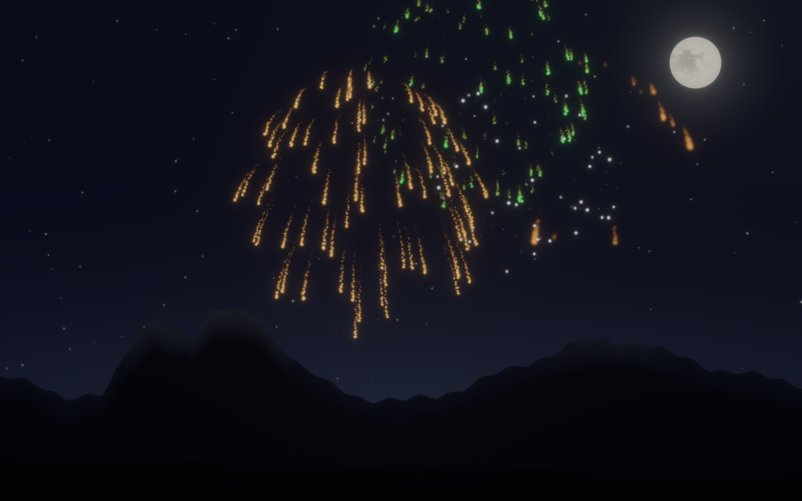

# Fireworks

A realistic fireworks simulator written in Rust with [Bevy](https://bevyengine.org/).

<p align="center">
  
</p>

The scene is a moonlit night over the Front Range west of Loveland, Colorado —
distant peaks with snowfields, dark hogback foothills, and foreground hills that
catch light from each burst. Shells launch from the valley floor behind the near
ridgeline; rising tails and falling embers appear and disappear around it.

## Screenshots

<p align="center">
  
  
  
</p>

## Requirements

- [Rust](https://rustup.rs/) 1.85 or newer (edition 2024)

## Run

```bash
cargo run --release
```

The app starts in borderless fullscreen on the primary monitor. Press **F11** to
toggle windowed mode, or **Esc** to quit.

For 1:1 pixel mapping at your monitor's resolution (larger fireworks and
landscape detail on high-DPI displays):

```bash
FIREWORKS_NATIVE=1 cargo run --release
```

Native mode scales the 1280×800 design space to match your display and updates
when you resize the window or toggle fullscreen.

## Controls

| Input | Action |
|-------|--------|
| Left click | Launch a shell that bursts at the clicked point |
| Space | Finale salvo (8 shells at once) |
| A | Toggle automatic launching (on by default) |
| F11 | Toggle borderless fullscreen |
| Esc | Quit |

The window is freely resizable. The scene uses a fixed 1280×800 virtual view
that scales uniformly to fit; taller or wider screens reveal extra sky and
horizon rather than stretching the composition.

## What makes it look real

- **Spherical bursts** – stars are sampled on a 3D sphere and projected to the
  screen, reproducing the dense-rimmed silhouette of real shell breaks.
- **Pyrotechnic colors** – palettes based on real emitters (strontium red,
  barium green, copper blue, sodium gold, magnesium silver), with white-hot
  ignition fading through the star's color into a dim orange ember.
- **Seven shell types** – peony, chrysanthemum, willow, palm, ring, crossette
  (stars that split mid-flight), and strobe.
- **Physics** – gravity, per-star aerodynamic drag, and a slowly wandering wind.
- **HDR + bloom** – particles render at HDR intensities through a soft radial
  texture and a bloom pass, so bright stars genuinely glow.
- **Night sky** – twinkling stars, a cratered moon, occasional faint satellite
  passes, and a soft horizon glow.
- **Landscape** – layered mountain silhouettes with moonlit snow, plus
  foreground hills whose mottled surface is relit by each burst.

## Development

### Regenerating screenshots

```bash
./scripts/capture_screenshots.sh
```

Still frames use `FIREWORKS_SCREENSHOT` and `FIREWORKS_SCENE`. GIFs capture a
frame sequence via `FIREWORKS_FRAME_DIR` (with `FIREWORKS_FRAME_END` and
`FIREWORKS_FRAME_STEP`), then assemble with [ffmpeg](https://ffmpeg.org/).

Ad-hoc still capture:

```bash
FIREWORKS_SCREENSHOT=shot.png cargo run --release
```

## License

MIT — see [LICENSE](LICENSE).
